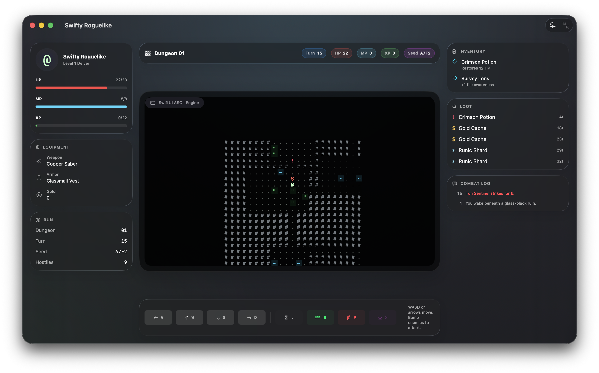

# Swifty Roguelike



Swifty Roguelike is a small experiment in building a game with an AI pair programmer from the first spark to a playable native app.

The entire project was created with GPT-5.5. The visual direction came from the `$imagegen` skill using ChatGPT Images 2.0, then the game was implemented as a native macOS SwiftUI app: a classic ASCII roguelike board wrapped in a modern glass interface, with procedural rooms, turn-based movement, combat, loot, leveling, and descendable dungeon floors.

The goal is not to pretend this is a finished game. It is a snapshot of what it feels like to ask for a vibe, turn that vibe into a real app, tighten the code, add a screenshot, publish the repo, and keep the whole thing small enough that you can still understand it in one sitting.

## What Is Here

This is an early playable prototype. The app currently includes:

- A 64x38 procedural dungeon map with rooms, corridors, doors, stairs, water, and foliage.
- A centered ASCII viewport rendered with SwiftUI `Canvas`.
- Turn-based movement, bump-to-attack combat, monster movement, resting, waiting, and potion use.
- Loot pickup for gold, potions, and runic shards.
- Player stats, inventory, nearby loot, equipment, run metadata, and combat log side panels.
- A generated `.app` bundle workflow for local runs.

## How It Was Made

This repository was built as a conversation:

1. Generate a mood and visual target with `$imagegen` and ChatGPT Images 2.0.
2. Scaffold a SwiftPM macOS app.
3. Build the roguelike loop: map generation, movement, combat, loot, and leveling.
4. Refine the SwiftUI interface into a glassy three-panel dungeon dashboard.
5. Clean up the codebase for a first public GitHub release.

That process is part of the project. The app is both a playable prototype and a little artifact of AI-assisted software creation.

## Requirements

- macOS 26 or newer.
- Xcode 26.4 or newer, or an equivalent Swift 6.3 toolchain.

The package manifest currently declares `.macOS(.v26)`, and the generated app bundle sets `LSMinimumSystemVersion` to `26.0`.

## Build

```sh
swift build
```

## Run

Use the helper script to build a local app bundle under `dist/` and launch it:

```sh
./script/build_and_run.sh
```

Other script modes:

```sh
./script/build_and_run.sh --verify
./script/build_and_run.sh --logs
./script/build_and_run.sh --telemetry
./script/build_and_run.sh --debug
```

The `dist/` directory is generated output and is intentionally ignored by git.

## Controls

- `W`, `A`, `S`, `D` or arrow keys: move.
- Bump into a monster: attack.
- `.`: wait.
- `R`: rest.
- `P`: use a Crimson Potion.
- `Command-N`: start a new run.
- Use the Descend toolbar or command bar action when standing on stairs.

## Project Layout

```text
Sources/SwiftyRoguelike/
  App/          macOS app entry point and window setup
  Game/         game state, procedural generation, and seeded RNG
  Models/       player, monsters, loot, map tiles, grid points, and actions
  Rendering/    ASCII dungeon rendering primitives
  Support/      keyboard notifications and window configuration
  Views/        SwiftUI panels, HUD, command bar, and main layout
script/         local build/run helpers
```

## Tests

There is no test target yet. Good first coverage would be deterministic dungeon generation, movement bounds, loot pickup, combat, and level-up behavior.
